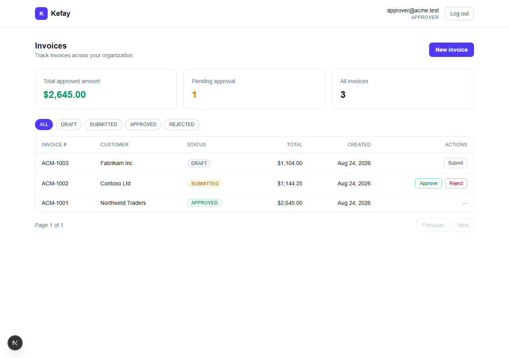

# Kefay — Multi-Tenant ERP Invoicing & Approvals

A full-stack ERP module demonstrating multi-tenant SaaS architecture, role-based
approval workflows, and transactional financial data — built on Next.js, NestJS,
Prisma, and PostgreSQL.

**Live demo:** _add your deployed URL here_ · **Frontend:** Next.js + TypeScript · **Backend:** NestJS · **DB:** PostgreSQL + Prisma



---

## Features

- **Multi-tenant isolation** — every record is scoped to its organization; one tenant
  can never read or write another's data, enforced centrally via a tenant guard.
- **Role-based access control** — JWT auth with STAFF and APPROVER roles; only
  approvers can approve or reject invoices.
- **Approval workflow** — invoices move through DRAFT → SUBMITTED → APPROVED / REJECTED
  with server-validated state transitions.
- **Transactional financial data** — invoices and their line items are created in a
  single atomic Prisma transaction, with subtotal, tax, and total computed server-side.
- **Dashboard** — invoice table with status filtering, sorting, pagination, and summary
  cards (total approved value, pending count).

## Architecture

```
Next.js (App Router, TypeScript, Tailwind)
    │   REST (JWT)
    ▼
NestJS API  ──►  tenant guard + role guard
    │
    ▼
Prisma ORM  ──►  PostgreSQL
```

The frontend consumes a JWT-protected REST API. A NestJS interceptor derives the
tenant (`orgId`) from the token and stores it in request-scoped `AsyncLocalStorage`;
a Prisma Client Extension reads that context and folds `orgId` into every query on
the `invoice` model automatically — isolation is guaranteed at the data-access layer,
not per-endpoint. Invoice writes run inside a Prisma `$transaction` to keep financial
totals consistent.

## Tech Stack

**Frontend:** Next.js · TypeScript · Tailwind · React Hook Form · Zod · TanStack Query
**Backend:** NestJS · TypeScript · Prisma · PostgreSQL · JWT
**Tooling:** Docker · docker-compose · Jest

## Running locally

```bash
git clone https://github.com/abelfree/kefay.git
cd kefay
docker-compose up --build
```

Then, once the stack is up, seed demo data:

```bash
docker compose exec api npm run seed
```

Open:
- Frontend → http://localhost:3000
- API → http://localhost:4000

### Demo logins (created by the seed script)

Two separate organizations are seeded — log in as each to confirm invoice data never crosses between them.

| Organization | Role     | Email                 | Password    |
| ------------ | -------- | ---------------------- | ----------- |
| Acme Corp    | Staff    | staff@acme.test        | password123 |
| Acme Corp    | Approver | approver@acme.test     | password123 |
| Globex Inc   | Staff    | staff@globex.test      | password123 |
| Globex Inc   | Approver | approver@globex.test   | password123 |

## Tests

```bash
cd backend && npm test
```

18 tests across 3 suites, targeting the mechanisms that matter most: tenant-scoping
(orgId injection, cross-tenant-id spoofing resistance), role-guard enforcement, and
invoice total calculation / status-transition validation.

## What this demonstrates

This project is a focused showcase of production-style full-stack engineering:
multi-tenant data isolation enforced centrally rather than per-handler, RBAC and
approval workflows, transactional integrity on financial data, and a clean separation
between a typed Next.js frontend and a modular NestJS backend — the core concerns of
building real ERP software.

---

_Built by [Abel Takele](https://github.com/abelfree) — Full-Stack & ERP Developer._
